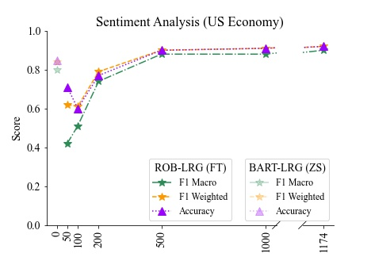
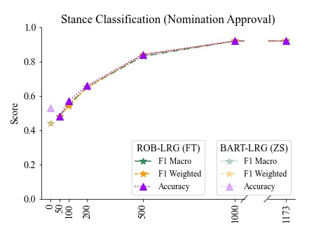
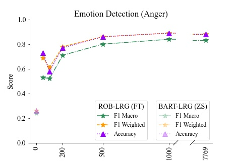
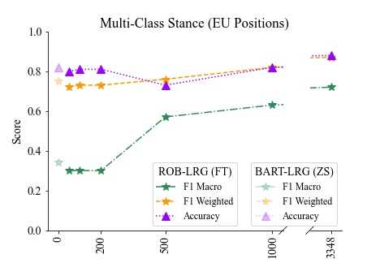

# Fine-Tuned ‘Small’ LLMs (Still) Outperform Zero-Shot Generative AI Models in Text Classification

Authors: [ Martin Juan José Bucher ](https://www.mnbucher.com), [ Marco Martini ](https://www.catherinedewolf.com/about)

[ [ Paper ] ](https://www.sciencedirect.com/science/article/pii/S0926580523003886) – Published on arXiv, June 2024

## Table of Contents
1. [ Abstract ](#1--abstract)
2. [ How to Use Our Toolkit ](#2--how-to-use-our-toolkit)
3. [ Results ](#3--results)
4. [ Citation ](#4--citation)

## 1 — Abstract
Generative AI offers a simple, prompt-based alternative to fine-tuning smaller BERT-style LLMs for text classification tasks, seemingly eliminating the need for manually labeled training data. However, empirical evidence is mixed as to whether tools like ChatGPT can completely replace the need for training models on labeled data. In this paper, we show that smaller, fine-tuned LLMs (still) consistently and significantly outperform larger, zero-shot prompted models in text classification. We compare three major generative AI models (ChatGPT with GPT-3.5 / GPT-4 and Claude Opus) with several fine-tuned LLMs across a diverse set of classification tasks (sentiment, approval/disapproval, emotions, party positions) and text categories (news, tweets, speeches). We find that fine-tuning with application-specific training data achieves superior performance in all cases. To make this approach more accessible to a broader audience, we provide an easy-to-use toolkit along with this paper. Our toolkit, accompanied by non-technical step-by-step guidance, enables users to select and fine-tune BERT-like LLMs for any classification task with minimal technical and computational effort.

## 2 — How to Use Our Toolkit
This chapter is intended as a guide to our text classification pipeline as contained in the folder `'02-pipeline'` as part of this repository. To allow users to train models based on their own input data, our toolkit has a slightly different setup than the pipeline containing the reproduction materials for the paper, which are contained in the folder `’01-reproduction-material’`. However, both pipelines are closely related. Consequently, the following steps should allow users to run both the custom pipeline as well as our replication code.

To conveniently use the fine-tuning pipeline presented in our paper, we provide our code as a Jupyter
Notebook file called `'pipeline-finetuning.ipynb'`. You can find the file [here](02-pipeline/pipeline-finetuning.ipynb).

If you do not have a machine with a GPU, we recommend setting up the pipeline on a Google Colab instance. This speeds up training significantly compared to a machine without a dedicated GPU. There are free options as well as possibilities to upgrade on memory and compute. We recommend testing the pipeline locally first. If cell F starts training successfully but runs for hours even with small datasets (~ 1k observations), setting up Google Colab is likely going to be worthwhile.

In case of any questions or problems regarding the pipeline, please refer to the Issue Tracker under this repository and create a new issue.

### 2.1 — Preparation
To be able to run the pipeline: (i) the annotated dataset should be provided in the right format (see Step D below as well as the instructions at the beginning of the `'pipeline-finetuning.ipynb' notebook) as two separate CSV files (one for the labels and one for the text samples), (ii) you need to have Jupyter Notebook running on your local machine (or use Google Colab).

### 2.2 — Installing Jupyter Notebook for Windows
On a Windows machine, the easiest way to get the notebook running is to install the Anaconda library, an open-source software containing Jupyter, Python, and other relevant packages (https://www.anaconda.com). There are plenty of tutorials online on how to install and launch Jupyter Notebook on Windows.

### 2.3 — Installing Jupyter Notebook for macOS
Install Jupyter through the pip package manager and the Command Line Interface (CLI): “pip install jupyter” or install it via Anaconda as well. Via CLI, you can start Jupyter with `jupyter lab`. This will open Jupyter under the path in which you ran the command. To simplify the browsing of the files, navigate to the folder location of this source code and run the above command at that location. It might be helpful to create a virtual environment using `venv` or `conda to avoid conflicting package dependencies with other python projects.

### 2.4 — The Notebook (Running Our Toolkit)
The following sections describe the individual cells in the `'pipeline-finetuning.ipynb'` notebook. After installing Jupyter Notebook, launch the `'pipeline-finetuning.ipynb'` file. Code cells in Jupyter Notebook can be executed via Menu > Run > Run Selected Cell (or simply with Shift + Enter).

#### Code Block A
The first code block is made up of three smaller code blocks and will install and import all the required packages. If you are running this notebook for the first time, you may want to uncomment all lines in the first code block that start with "!pip ...". Running this block will then install all necessary packages via `pip`. If you want to enable reproducibility for later runs, you can also run the second block, but it is not required. After the first block has installed the packages, you can run the third block to load the packages into your Python runtime. No changes are necessary if all packages have already been installed. To speed up later runs, you can comment out the first block again to avoid reinstalling all packages if you run the notebook multiple times. Thus, only the third block is needed for later runs to correctly load all installed required packages.

#### Code Block B
Next, define the required parameters (variables). In particular, set the following variables:

* ```PROJECT_NAME```: This should be a unique name describing your project.
* ```DATASET```: The name of the subfolder where your dataset is stored inside the “data” folder. If the dataset is named “elections”, then a folder “elections” should exist within the “data” folder. Inside this folder, place your CSVs (see Step D below).
* ```LANGUAGE_FOR_MODEL```: Select the language of your dataset/corpus.
* ```LANGUAGE_MODEL```: Select the pre-trained model you want to fine-tune on your classification task.

#### Code Block C
This step allows setting optional parameters that require some knowledge on how to optimize deep neural
networks. Skip this section to go with the default parameters. As shown in our paper, the default parameters achieve already strong performance.

IMPORTANT: Even if using the default parameters, you need to run this cell to define all variables during runtime.

#### Code Block D
Import the dataset as two different CSVs:

* The first CSV file contains all sentences (i.e. the text data), where each row contains one sample (e.g. a tweet). A row does not necessarily need to contain a single sentence, but should not be overly long as most encoder-style language models have a maximum capacity of reading 512 tokens (1 token is roughtly 1.5 words, so they take around 768 words per sample).
* The second CSV file contains the labels, where each row contains one integer number corresponding to the class of the texts in the first file (the label in row 1 in the second file must indicate the class of the text in row 1 of the first file, and so on). Thus, the order of the rows from the first file and the second file should match exactly and the files should have the same number of rows.

#### Code Block E (Optional)
It is possible to provide an additional logging instance using the `Weights & Biases` platform. To do so, you need to create an account and a corresponding project and link the notebook with your API key. Having an external logging platform makes it possible to track and compare different experiments across time and to compare the performance of different hyperparameter configurations directly in the Cloud. If the logging function is turned off, it will simply print out the metrics directly into the Jupyter Notebook. Once the notebook is closed, these results are gone.

#### Code Block F
This code block implements the fine-tuning of the model using the provided training data. Depending on your available hardware, model choice, dataset size, and hyperparameter settings, this can take from minutes to hours.

#### Code Block G
Running this code block will auto-label your unseen data (the "test set") based on your fine-tuned model. The output is stored in the data folder under your project name. It is possible to store the model weights for later usage. A folder `ckpt` will be created and within this folder another folder with the name of your `RUN_ID`. Inside the latter folder be a file with the ending `'[...] .pth.tar'`. These are the model weights. Downloading this file with the corresponding folder hierarchy (i.e. `ckpt/YOUR_RUN_ID/ckpt_last_seed_1234.pth.tar`), makes it possible to re-use this model at a later stage without the need to fine-tune your model again.

### 2.5 — Optional: Run the Toolkit on Google Colab with GPU Support
Go to `www.colab.research.google.com`, login with your Google credentials, and create a new notebook.

Next, go to the menu and click "Runtime" > "Change Runtime Type". Under "Hardware Accelerator", which defaults to "None" (or "CPU"), choose one of the fields with "GPU" in the title (names may differ). This should successfully connect to one of Google’s GPUs after a few seconds.

Upload your dataset(s). This can be done in several ways.

The easiest way is to simply mount your personal google drive. This way, you can directly load the entire folder structure into your google drive and have the script store the results there (and thus make it available after you exit the Colab session). To this end, upload the entire `'02-pipeline'` folder into Google drive. Then open `'pipeline-finetuning.ipynb'` by right-clicking and selecting “Open with … Google Colab”.

Next, to mount the Google drive, insert the following code at the beginning of your notebook (and run it before running the rest of the notebook):

```
from google.colab import drive
drive.mount('/content/drive')
```

Then navigate to the main folder (the exact path will depend on where you put the '02-pipeline'` folder in your drive)

```
%cd /content/drive/MyDrive/…/02-pipeline
```

Verify the folder content with to make sure it reflects the same files as if running locally or uploaded manually to a Colab session:
```
!ls
```

Lastly, execute the remaining cells of the `'pipeline-finetuning.ipynb' in the same way as via Jupyter.

Step F should now run noticeably faster.


## 3 — Results

We evaluate the following models across our case studies. 

* **MAJ-VOT** — As a baseline, we use a \textit{failed classifier} that assigns the majority class to all observations. For imbalanced datasets, this can suggest good performance on metrics sensitive to class-imbalance (e.g., Accuracy). However, metrics such as Recall or F1-Score reveal that this classifier performs poorly for the minority class(es).
* **ROB-BASE** (125M) — RoBERTa Base \cite{liu2019roberta}, provided as \texttt{'roberta-base'} via Hugging Face (HF) \cite{wolf2020transformers}, is pre-trained in a self-supervised manner using masked language modeling (MLM).
* **ROB-LRG** (355M) — RoBERTa Large, provided as \texttt{'roberta-large'}, is similar to RoBERTa Base but has more parameters. This boosts performance but increases computational costs.
* **DEB-V3** (435M) — DeBERTa, provided as \texttt{'microsoft/deberta-v3-large'}, builds on BERT/RoBERTa. Despite its similar size, it takes substantially longer to fine-tune because of differences in architecture.
* **ELE-LRG** (335M) — ELECTRA Large, provided as \texttt{'google/electra-large-discriminator'} and \texttt{'german-nlp-group/electra-base-german-uncased'}, was introduced by \cite{clark2020electra}. ELECTRA claims to be more compute-efficient than existing alternatives.
* **XLNET-LRG** (340M) — XLNet \cite{yang2019xlnet}, provided as \texttt{'xlnet-large-cased'}, was pre-trained with an autoregressive method to learn bidirectional contexts and has beens shown to perform comparable to RoBERTa.
* **BART-LRG** (407M) — BART was introduced by Facebook \cite{lewis2019bart} and uses an encoder-decoder model. BART can generate text similar to ChatGPT and Claude, although relying on a different architecture. More details are provided in Appendix B.
* **GPT-3.5** (175B+) / **GPT-4** (n/a) — ChatGPT, developed by OpenAI \cite{ouyang2022training}. It has substantially more parameters than any of the previsouly listed models (GPT-3.5 = 175B, GPT-4 $\approx$ 1.8T \footnote{The exact number of parameters for GPT-4 is unknown given OpenAI no longer reveals technical details of its models but many sources claim it might be around 1.8T}. ChatGPT can process complex input texts and generate text of varying length as output. We use the \texttt{'gpt-3.5-turbo'} and \texttt{'gpt-4-1106-preview'} checkpoints provided by their API. Details about prompting are provided in Appendix A.
* **CLD-OPUS** (n/a) — Claude 3 Opus, developed by Anthropic \cite{anthropic2024claude}. The model size and technical details remain undisclosed. Opus can handle complex input prompts on par with GPT4, according to various benchmarks and empirical results published by Anthropic. We use the \texttt{'claude-3-opus-20240229'} checkpoint provided by their API. Details about prompting are provided in Appendix A.
\end{itemize}

### 3.1 — Sentiment Analysis on The New York Times Coverage of the US Economy
Results are presented in Table 1. The strongest results are achieved by ROB-LRG and DEB-V3.6 Most other fine-tuned models except XLNET-LRG also achieve strong results with values around 0.90 and small variances (indicating that the random seed has little effect on model performance). BART, ChatGPT, and Claude also perform well on the sentiment task but remain behind the fine-tuned models.

| Model Name  | Accuracy | Prec. (wgt.) | Recall (wgt.) | F1 (macro) | F1 (wgt.) |
|-------------|----------|--------------|---------------|------------|-----------|
| MAJ-VOT     | 0.73 (±0.00) | 0.53 (±0.00) | 0.73 (±0.00) | 0.42 (±0.00) | 0.61 (±0.00) |
| ROB-BASE    | 0.89 (±0.00) | 0.89 (±0.01) | 0.89 (±0.00) | 0.86 (±0.01) | 0.89 (±0.01) |
| **ROB-LRG** | **0.92 (±0.01)** | **0.92 (±0.01)** | **0.92 (±0.01)** | **0.90 (±0.01)** | **0.92 (±0.01)** |
| DEB-V3      | 0.92 (±0.02) | 0.92 (±0.01) | 0.92 (±0.02) | 0.90 (±0.02) | 0.92 (±0.01) |
| ELE-LRG     | 0.90 (±0.01) | 0.90 (±0.01) | 0.90 (±0.01) | 0.88 (±0.02) | 0.90 (±0.01) |
| XLNET-LRG   | 0.81 (±0.01) | 0.85 (±0.01) | 0.81 (±0.01) | 0.78 (±0.01) | 0.82 (±0.01) |
| BART-LRG    | 0.85 (±0.00) | 0.84 (±0.00) | 0.85 (±0.00) | 0.80 (±0.00) | 0.84 (±0.00) |
| GPT-3.5     | 0.82 (±0.00) | 0.84 (±0.00) | 0.82 (±0.00) | 0.79 (±0.00) | 0.83 (±0.00) |
| GPT-4       | 0.87 (±0.00) | 0.87 (±0.00) | 0.87 (±0.00) | 0.84 (±0.00) | 0.87 (±0.00) |
| CLD-OPUS    | 0.86 (±0.00) | 0.87 (±0.00) | 0.86 (±0.00) | 0.83 (±0.00) | 0.87 (±0.00) |

**Note**: Results for fine-tuned models on unseen test set with $N=200$. Results for BART, GPTs, and Claude on full data. Fine-tuned models use gradient accumulation with 8 steps and batch size 4, except DEB-V3 (batch size 2).


### 3.2 — Stance Classification on Tweets about Kavanaugh Nomination
Results are reported in Table 2. We achieve the strongest results with DEB-V3 and ROB-LRG with a performance of 0.94 and 0.92 respectively across metrics. The other three fine-tuned models show some variation. However, all fine-tuned models surpass the prompt-based approaches: BART, ChatGPT, and Claude perform rather weak on this more subtle task and score only marginally above the naive majority vote baseline.

| Model Name  | Accuracy      | Prec. (wgt.)  | Recall (wgt.) | F1 (macro)    | F1 (wgt.)      |
|-------------|---------------|---------------|---------------|---------------|----------------|
| MAJ-VOT     | 0.50 (±0.00)  | 0.25 (±0.00)  | 0.50 (±0.00)  | 0.33 (±0.00)  | 0.33 (±0.00)   |
| ROB-BASE    | 0.86 (±0.01)  | 0.86 (±0.01)  | 0.86 (±0.01)  | 0.86 (±0.01)  | 0.86 (±0.01)   |
| ROB-LRG     | 0.92 (±0.01)  | 0.93 (±0.01)  | 0.92 (±0.01)  | 0.92 (±0.01)  | 0.92 (±0.01)   |
| **DEB-V3**  | **0.94 (±0.01)** | **0.94 (±0.01)** | **0.94 (±0.01)** | **0.93 (±0.01)** | **0.94 (±0.01)** |
| ELE-LRG     | 0.74 (±0.01)  | 0.66 (±0.02)  | 0.74 (±0.01)  | 0.67 (±0.02)  | 0.69 (±0.02)   |
| XLNET-LRG   | 0.83 (±0.01)  | 0.83 (±0.01)  | 0.83 (±0.01)  | 0.83 (±0.01)  | 0.83 (±0.01)   |
| BART-LRG    | 0.53 (±0.00)  | 0.59 (±0.00)  | 0.53 (±0.00)  | 0.44 (±0.00)  | 0.44 (±0.00)   |
| GPT-3.5     | 0.53 (±0.00)  | 0.58 (±0.00)  | 0.53 (±0.00)  | 0.48 (±0.00)  | 0.47 (±0.00)   |
| GPT-4       | 0.58 (±0.00)  | 0.68 (±0.00)  | 0.58 (±0.00)  | 0.51 (±0.00)  | 0.51 (±0.00)   |
| CLD-OPUS    | 0.61 (±0.00)  | 0.68 (±0.00)  | 0.61 (±0.00)  | 0.57 (±0.00)  | 0.57 (±0.00)   |

**Note**: Results for fine-tuned models on unseen test set with $N=200$. Results for BART, GPTs, and Claude on full data. Fine-tuned models use gradient accumulation with 8 steps and batch size 4, except DEB-V3 (batch size 2).


### 3.3 — Emotion Detection on Political Texts in German
The results are presented in Table 3. XLNET-LRG achieves the best results closely followed by ELECTRA, ROB-LRG, and DEB-V3. The ELECTRA model performs almost identically on the original German text and on the English translation. Translation can thus be a viable option when no language-specific pre-trained model exists.

| Model Name   | Accuracy      | Prec. (wgt.)  | Recall (wgt.) | F1 (macro)    | F1 (wgt.)      |
|--------------|---------------|---------------|---------------|---------------|----------------|
| MAJ-VOT      | 0.71 (±0.00)  | 0.51 (±0.00)  | 0.71 (±0.00)  | 0.42 (±0.00)  | 0.59 (±0.00)   |
| ROB-BASE     | 0.87 (±0.01)  | 0.88 (±0.01)  | 0.87 (±0.01)  | 0.82 (±0.01)  | 0.88 (±0.01)   |
| ROB-LRG      | 0.88 (±0.01)  | 0.88 (±0.00)  | 0.88 (±0.01)  | 0.83 (±0.00)  | 0.88 (±0.00)   |
| DEB-V3       | 0.88 (±0.01)  | 0.88 (±0.00)  | 0.88 (±0.01)  | 0.83 (±0.01)  | 0.88 (±0.00)   |
| ELE-LRG      | 0.88 (±0.00)  | 0.88 (±0.02)  | 0.88 (±0.00)  | 0.84 (±0.00)  | 0.88 (±0.00)   |
| **XLNET-LRG**| **0.89 (±0.00)** | **0.89 (±0.00)** | **0.89 (±0.00)** | **0.85 (±0.00)** | **0.89 (±0.00)** |
| ELE-BS-GER   | 0.88 (±0.01)  | 0.88 (±0.01)  | 0.88 (±0.01)  | 0.83 (±0.02)  | 0.88 (±0.01)   |
| BART-LRG     | 0.26 (±0.00)  | 0.36 (±0.00)  | 0.26 (±0.00)  | 0.24 (±0.00)  | 0.29 (±0.00)   |
| GPT-3.5      | 0.15 (±0.00)  | 0.23 (±0.00)  | 0.15 (±0.00)  | 0.15 (±0.00)  | 0.16 (±0.00)   |
| GPT-4        | 0.20 (±0.00)  | 0.18 (±0.00)  | 0.20 (±0.00)  | 0.18 (±0.00)  | 0.13 (±0.00)   |
| CLD-OPUS     | 0.15 (±0.00)  | 0.16 (±0.00)  | 0.15 (±0.00)  | 0.14 (±0.00)  | 0.11 (±0.00)   |

**Note**: Results for fine-tuned models on unseen test set with $N=200$. Results for BART, GPTs, and Claude on full data. Fine-tuned models use gradient accumulation with 8 steps and batch size 4, except DEB-V3 (batch size 2).


### 3.4 — Multi-Class Stance Classification on Parties’ EU Positions
Results are shown in Table 4. DEB-V3 outperforms all other models, scoring well above 0.90 for most metrics. Most other fine-tuned models perform at least decently. BART, ChatGPT, and Claude, however, again do not exceed the naive baseline classifier — suggesting once more that the fine-tuning approach is superior when tasks are non-standard or context-specific.

| Model Name | Accuracy      | Prec. (wgt.)  | Recall (wgt.) | F1 (macro)    | F1 (wgt.)      |
|------------|---------------|---------------|---------------|---------------|----------------|
| MAJ-VOT    | 0.83 (±0.00)  | 0.68 (±0.00)  | 0.83 (±0.00)  | 0.30 (±0.00)  | 0.75 (±0.00)   |
| ROB-BASE   | 0.84 (±0.00)  | 0.87 (±0.01)  | 0.84 (±0.00)  | 0.70 (±0.02)  | 0.85 (±0.00)   |
| ROB-LRG    | 0.88 (±0.01)  | 0.88 (±0.01)  | 0.88 (±0.01)  | 0.72 (±0.03)  | 0.87 (±0.01)   |
| **DEB-V3** | **0.92 (±0.01)** | **0.91 (±0.01)** | **0.92 (±0.01)** | **0.82 (±0.02)** | **0.91 (±0.01)** |
| ELE-LRG    | 0.88 (±0.01)  | 0.88 (±0.01)  | 0.88 (±0.01)  | 0.75 (±0.03)  | 0.87 (±0.01)   |
| XLNET-LRG  | 0.87 (±0.01)  | 0.89 (±0.01)  | 0.87 (±0.01)  | 0.75 (±0.02)  | 0.88 (±0.01)   |
| BART-LRG   | 0.82 (±0.00)  | 0.77 (±0.00)  | 0.82 (±0.00)  | 0.34 (±0.00)  | 0.75 (±0.00)   |
| GPT-3.5    | 0.24 (±0.00)  | 0.65 (±0.00)  | 0.24 (±0.00)  | 0.17 (±0.00)  | 0.27 (±0.00)   |
| GPT-4      | 0.38 (±0.00)  | 0.73 (±0.00)  | 0.38 (±0.00)  | 0.26 (±0.00)  | 0.45 (±0.00)   |
| CLD-OPUS   | 0.26 (±0.00)  | 0.75 (±0.00)  | 0.26 (±0.00)  | 0.25 (±0.00)  | 0.29 (±0.00)   |

**Note**: Results for fine-tuned models on unseen test set with $N=200$. Results for BART, GPTs, and Claude on full data. Fine-tuned models use gradient accumulation with 8 steps and batch size 4, except DEB-V3 (batch size 2).


### 3.5 — Fine-Tuning: The Effect of Training Set Size on Model Performance
Figure 1 show how model performance increases with training data size. For model performance, we report F1 Macro, F1 Weighted, and Accuracy on the y-axis. For dataset size, we report sample size N on the x-axis. Overall, we see that performance picks up quickly as the amount of training data grows from minimal to moderate levels and then saturates as the training set size increases further.10 This effect is most pronounced for more balanced datasets (e.g., the Kavanaugh Nomination Tweets). For imbalanced datasets (especially, EU positions data), we see high (but meaningless) accuracy scores at low sample sizes because poorly trained models always predict the majority class. Macro-F1 scores, however, which punish naive majority class prediction, consistently show the saturation pattern. Overall, the sweet-spot tends to lie between 200 and 500 training observations. Below 200 observations, model performance remains below its potential. Above 500 observations, performance begins to level off.

<table>
  <tr>
    <td></td>
    <td></td>
  </tr>
  <tr>
    <td></td>
    <td></td>
  </tr>
</table>

Figure 1: Effect of training set size on model performance: Results for ROB-LRG with varying number of training observations N = {50, 100, 200, 500, 1000}. The translucent markers above the 0-point denote the zero-shot results of BART. The rightmost points denote model performance if trained on the full dataset.

## 4 — Citation
If using our toolkit or reference our work, please cite us as follows:

```bibtex
@article{raghu2023resourcecadastre,
  title={Towards a Resource Cadastre for a Circular Economy – Urban-Scale Building Material Detection Using Street View Imagery and Computer Vision},
  author={Raghu, D. and Bucher, M. and DeWolf, C.},
  journal={Resources, Conservation and Recycling},
  year={2023}
}
```
